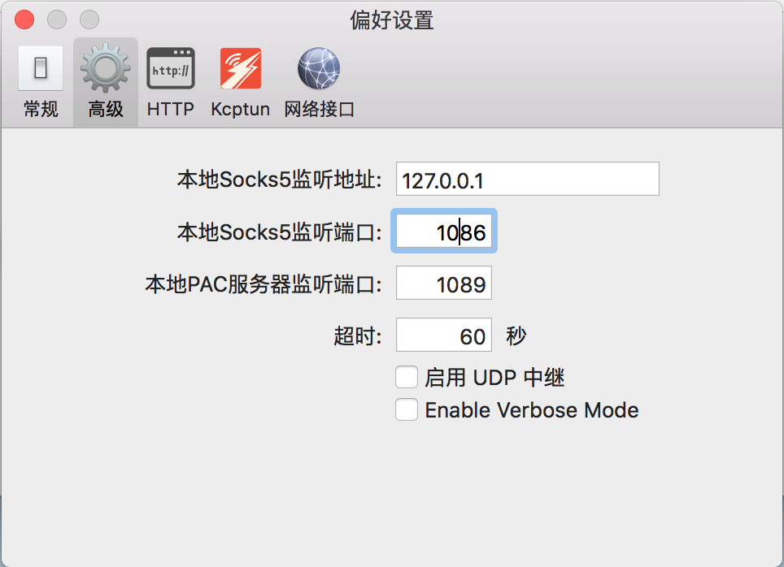

## 一览

+ [SSH 登录](#1)
+ [Shadowsockets + proxychains4](#6)
+ [YUM](#2)
+ [MongoDB](#3)
+ [Nginx](#4)
+ [Maven](#5)
+ [Python](#6)

<h2 id='1'>SSH 登录</h2>

> 客户机为 `MacOS`
+ 在客户机上生成钥匙串
  ```
  $ ssh-keygen -t rsa -C "a@example.com"
  ```
  + `-t`: 加密方式， `rsa` 是现在最安全的一种
  + `-C`: 添加一些注释进行标记
+ 执行命令后会被询问一些信息
  + 给这个新的密钥输入一个名称，保留默认的名字和设置
  + 提供一个密码
+ 完成后在 `~/.ssh` 中能查找到 `id_rsa.pub` 和 `id_rsa`，第一个是公钥，第二个是私钥。
+ 在服务器上配置 `ssh`
  ```
  // 检查是否存在 ssh 服务
  $ rpm –qa|grep ssh
  // 如果没有则先下载并启动
  $ yum install ssh
  $ systemctl start ssh
  ```
+ 将客户机上的公钥 `~/.ssh/id_rsa.pub` 复制到服务器的 `~/.ssh/authorized_keys` 即可

<h2 id='6'>Shadowsockets + proxychains4</h2>

### MacOS
> 10.11.6
在 `Mac` 上安装了 `shadowsockets` 进行科学上网以后，发现 `terminal` 的流量还是没有通过代理IP进行请求。所以为了实现这个功能，我们再重新安装 `proxychains4` 。

+ 首先验证一下自己的 `terminal` 是不是没有代理成功
  ```
  $ ping ip.cn
  // 当前 IP：116.231.xx.xx 来自：上海市 电信
  ```
+ 安装 `proxychains4`
  ```
  $ brew install proxychains4
  ```
+ 因为高版本的 `MacOS` 系统推出了 `System Integrity Protection` 功能，会阻碍 `proxychain` 通过修改环境变量的方式达到代理 `terminal` 的目的，所以我们先关闭 `SIP`。
  + 先检查一下是否已经关闭
    ```
    $ csrutil status
    // System Integrity Protection status: enabled.
    ```
  + 重启电脑，长按 `option`，进入选择页面后，按住 `Command + R`，进入系统恢复页面，左上角工具里选择 **[终端]**
    ```
    $ csrutil disable
    ```
  + 重启电脑，检查是否关闭
    ```
    $ csrutil status
    // System Integrity Protection status: disabled.
    ```
+ 查看 `shadowsockets` 客户端 `socks5` 的监听端口
  > 以 `ShadowsocketsX-NG` 为例
  ```
  偏好设置 -> 高级 -> 本地socks5监听端口
  ```
  

+ 修改 `proxychains4` 配置，在末尾加上 `socks5 127.0.0.1 port`，`port` 是在上面查看到的 `socks5` 监听的端口
    ```
    // 配置路径
    $ /usr/local/etc/proxychains.conf
    ```
+ 验证一下是否成功
  ```
  $ ping ip.cn
  // 当前 IP：103.192.xx.xx 来自：香港特别行政区 xTom
  ```


<h2 id='2'>YUM</h2>

> 3.4.3

### Configuration
> + [YUM 配置说明](https://access.redhat.com/documentation/en-us/red_hat_enterprise_linux/6/html/deployment_guide/sec-configuring_yum_and_yum_repositories)
> + [CentOS yum 源的配置与使用](https://www.cnblogs.com/mchina/archive/2013/01/04/2842275.html)
+ `yum.conf`
  ```
  $ /etc/yum/yum.conf
  ```
+ `cachedir`: `yum` 缓存的目录，`yum` 在此存储下载的 `rpm` 包和数据库，默认设置为 `/var/cache/yum`
+ `keepcache`: 安装完成后是否保留软件包，0为不保留 **（默认为0）** ，1为保留
+ `debuglevel`: Debug 信息输出等级，范围为0-10，缺省为2
+ `logfile`: `yum` 日志文件位置
+ `pkgpolicy`: 包的策略。一共有两个选项，`newest` 和 `last` ，这个作用是如果你设置了多个 `repository`，而同一软件在不同的 `repository` 中同时存在，`yum` 应该安装哪一个，如果是 `newest` ，则 `yum` 会安装最新的那个版本。如果是 `last` ，则 `yum` 会将服务器 `id` 以字母表排序，并选择最后的那个服务器上的软件安装。一般都是选 `newest`。
+ `distroverpkg`: 指定一个软件包，`yum` 会根据这个包判断你的发行版本，默认是 `redhat-release`，也可以是安装的任何针对自己发行版的 `rpm` 包。
+ `tolerant`: 有1和0两个选项，表示 `yum` 是否容忍命令行发生与软件包有关的错误，比如你要安装1,2,3三个包，而其中3此前已经安装了，如果你设为1,则 `yum` 不会出现错误信息。默认是0。
+ `exactarch`: 有1和0两个选项，设置为1，则 `yum` 只会安装和系统架构匹配的软件包，例如，`yum` 不会将i686的软件包安装在适合i386的系统中。默认为1。
+ `retries`: 网络连接发生错误后的重试次数，如果设为0，则会无限重试。默认值为6.
+ `obsoletes`: 这是一个 `update` 的参数，具体请参阅yum(8)，简单的说就是相当于 `upgrade` ，允许更新陈旧的RPM包。
+ `plugins`: 是否启用插件，默认1为允许，0表示不允许。

### Sources

`YUM` 的源分为本地源和网络源，本地源需要关联挂载的磁盘地址，网络源需要关联外部源仓库地址。在 `/etc/yum.repos.d/` 中，有 `CentOS-Base.repo` 和 `CentOS-Epel.repo`。其中 `Base` 是网络源的配置，`Epel` 是 `Epel` 源的配置，默认没有 `CentOS-Media.repo` 本地源的配置。如果需要，可以进行手动添加，也可以在该路径下添加一些针对特殊的软件的源，类似 `docker-ce.repo`，在安装的过程中会首选这个源。

### Cli

+ 列出所有已安装的软件包 
  ```
  $yum list installed 
  ```
+ 使用YUM查找软件包 
  ```
  $ yum search 
  ```
+ 列出所有 可安装/可更新/已安装但不在 `Yum Repository` 的软件包 
  ```
  $ yum list/updates/extras
  ``` 
+ 使用YUM获取 可更新/已安装/已安装但不在 `Yum Repository` 软件包信息 
  ```
  $ yum info updates/installed/extras
  ```
+ 列出软件包提供哪些文件 
  ```
  $ yum provides
  ```


<h2 id='3'>MongoDB</h2>

> 3.2.19

### Path
+ `mongod.conf`
  > `mongod` 全局设置文件，[设置文件说明文档](https://docs.mongodb.com/v3.2/reference/configuration-options/)
  ```
  $ /etc/mongod.conf
  ```
+ `mongod.log`
  > 可以在 `mongod.conf` 中进行配置，下面给出默认路径，
  > 可以很方便的通过 `log` 信息进行排错
  ```
  $ /var/log/mongodb/mongod.log
  ```
+ `mongod`
  > `mongodb` 的执行文件
  ```
  $ /usr/bin/mongod
  ```

### Authorize
+ 创建 `admin account`

  ```
  $ mongo
  $ use admin
  $ db.createUser({user:"admin",pwd:"password",roles:["root"]})
  ```
+ 创建 `db owner`

  ```
  $ mongo
  // 需要先进行登录
  $ use admin
  $ db.auth("admin", "password")
  // 切到需要分配角色的数据库，这里以 test 为例
  $ use test
  $ db.createUser({user: "testOnwer", pwd: "password", roles: [{ role: "dbOwner", db: "testOnwer" }]})
  ```
+ 如果忘记 `admin` 密码

  ```
  // 先去掉 systemctl script Environment 中的 -auth
  $ systemctl daemon-reload
  $ systemctl restart mongod
  $ mongo
  $ use admin
  $ db.system.users.remove({})
  $ db.createUser({user:"admin",pwd:"password",roles:["root"]})
  // 恢复 systemctl script Environment 中的 -auth
  $ systemctl daemon-reload
  $ systemctl restart mongod
  ```

### Systemctl launcher script

```
[Unit]
Description=MongoDB Database Server
After=network.target
Documentation=https://docs.mongodb.org/manual

[Service]
User=mongod
Group=mongod
Environment="OPTIONS=-f /etc/mongod.conf -auth"
ExecStart=/usr/bin/mongod $OPTIONS
ExecStartPre=/usr/bin/mkdir -p /var/run/mongodb
ExecStartPre=/usr/bin/chown mongod:mongod /var/run/mongodb
ExecStartPre=/usr/bin/chmod 0755 /var/run/mongodb
PermissionsStartOnly=true
PIDFile=/var/run/mongodb/mongod.pid
Type=forking
# file size
LimitFSIZE=infinity
# cpu time
LimitCPU=infinity
# virtual memory size
LimitAS=infinity
# open files
LimitNOFILE=64000
# processes/threads
LimitNPROC=64000
# locked memory
LimitMEMLOCK=infinity
# total threads (user+kernel)
TasksMax=infinity
TasksAccounting=false
# Recommended limits for for mongod as specified in
# http://docs.mongodb.org/manual/reference/ulimit/#recommended-settings

[Install]
WantedBy=multi-user.target
```
### Issue && Solution

+ 外部服务器连接
  
  
  因为默认设置的 `bindIp` 设置是 `127.0.0.1` 所以只能在本机上进行连接。如果需要 `bind` 所有的 `IPv4 IP`，可以设置为 `0.0.0.0`

+ 数据库文件备份、恢复、导入和导出
  >在本地对本地数据库进行操作均可忽略 `-h`，`--port` 参数

  备份
  ```
  $ mongodump -h IP --port 端口 -u 用户名 -p 密码 -d 数据库 -o 文件存在路径
  ```

  恢复
  ```
  $ mongorestore -h IP --port 端口 -u 用户名 -p 密码 -d 数据库 --drop 文件存在路径
  ```

  导出
  ```
  $ mongoexport -h IP --port 端口 -u 用户名 -p 密码 -d 数据库 -c 表名 -f 字段
  ```
  + `-f: ` 导出指字段，以字号分割，`-f a,b,c` 导出3个字段，如果不填则导出整张表
  + `-o: ` 导出的文件名，可以加后缀名
  + `-q: ` 导出的 `filter`， `-q '{ "_id" : "1" }'` 只导出 `_id="1"` 的数据
  + `--csv: ` 表示导出的文件格式为 `csv`

  导入
  ```
  $ mongoimport -h IP --port 端口 -u 用户名 -p 密码 -d 数据库 -c 表名 --upsert --drop 文件名
  ```
  以上命令是导入 **非csv文件** ，如果是 **csv文件** 用 `--headerline` 替换 `--upsert`，如果不是整张表而是字段，则用 `--upsertFields a,b,c` 替换 `--upsert`

<h2 id='4'>Nginx</h2>

<h2 id='5'>Maven</h2>

<h2 id='6'>Python</h2>

### 升级 `Python` 版本

#### 使用 `yum` 安装
+ 如果 `yum` 没有 `Epel` 的源，先安装
  ```
  $ yum install epel-release
  ```
+ 安装 `Python3`
  ```
  $ yum install python34
  ```
+ 这个是没有安装 `Pip` 的，如果需要可以下载安装
  ```
  $ curl -O https://bootstrap.pypa.io/get-pip.py
  $ sudo /usr/bin/python3.4 get-pip.py
  ```

#### 使用压缩文件安装
+ 下载压缩包
  ```
  $ wget https://www.python.org/ftp/python/3.5.2/Python-3.5.2.tgz
  ```
+ 解压缩，安装编译环境 `gcc`
  ```
  $ tar -zxvf Python-3.5.2.tgz
  $ yum install make gcc gcc-c++
  ```
+ 编译安装
  ```
  $ cd Python-3.5.2
  $ ./configure && make && make install
  ```
#### 修改软连接
+ 查看软连接，记下 `python3` 指向的路径 
  > 假设这个指向的路径就是 `python3`（相对路径）
  ```
  $ ls -al /usr/bin | grep python
  ```
+ 重命名 `python` 软连接文件
  ```
  $ mv /usr/bin/python /usr/bin/python.bak
  ```
+ 新建软连接
  ```
  $ ln -s /usr/bin/python3 /usr/bin/python
  ```